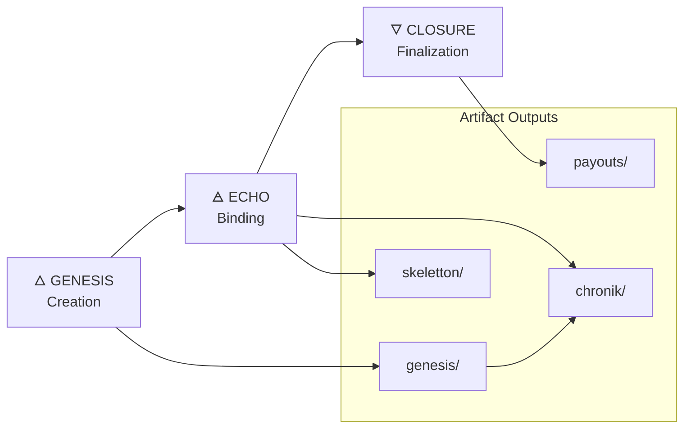

# 🔱 **FLOW.md — Chain2025 Ritual Flow (Genesis → Echo → Closure)**  
### *CoreCraft Genesis • Deterministic Ritual Pipeline*

This document describes the **complete operational flow** of the Chain2025 Ritual Engine, covering the three canonical phases:

1. **Genesis** — Creation  
2. **Echo** — Binding  
3. **Closure** — Finalization  

The flow is **deterministic**, **validator‑controlled**, and produces **audit‑sealed artifacts**.

---

# 🜂 **1. Overview of the Ritual Engine**

The Ritual Engine executes a **three‑phase lifecycle**:

```
GENESIS  →  ECHO  →  CLOSURE
   |         |         |
Create     Bind     Finalize
```

Each phase:

- is executed **locally**  
- produces **immutable artifacts**  
- updates the **Chronik**  
- is validated by **signatures** or **deterministic scripts**  

No phase depends on external RPC endpoints.

---

# 🜁 **2. Phase 1 — GENESIS (Creation)**

Genesis establishes the **initial state** of the Chain2025 environment.

### **Purpose**
- Create the genesis block  
- Define validator set  
- Initialize chain configuration  
- Seal the initial state  

### **Inputs**
- `genesis.json`  
- Validator signatures  
- Chain configuration manifests  

### **Process**
1. Load genesis configuration  
2. Validate structure and signatures  
3. Initialize chain directory  
4. Seal genesis block  
5. Generate genesis artifacts  

### **Outputs**
Stored in `genesis/`:

- `genesis.json` (final)  
- `alloc.json`  
- `validators.txt`  
- `genesis-hash.txt`  
- `genesis-proof.log`  

### **Chronik Entry**
```
chronik/genesis-<timestamp>.json
```

### **Security Notes**
- Must be executed offline or on secured hardware  
- Validator keys must never leave the machine  

---

# 🜄 **3. Phase 2 — ECHO (Binding)**

Echo binds **events, signatures, and state changes** to the chain’s operational timeline.

### **Purpose**
- Register echo events  
- Bind validator actions  
- Update the Echo Registry  
- Extend the Chronik  

### **Inputs**
- Ritual manifests  
- Validator signatures  
- Driftpoint (Skeletton™) data  
- Previous Chronik entries  

### **Process**
1. Load ritual manifest  
2. Validate signatures  
3. Register echo event  
4. Update Echo Registry  
5. Append to Chronik  

### **Outputs**
Stored in `chronik/` and `skeletton/`:

- `echo-<id>.json`  
- `registry-update.json`  
- `driftpoint-<id>.txt`  
- `echo-proof.log`  

### **Chronik Entry**
```
chronik/echo-<timestamp>.json
```

### **Security Notes**
- Echo events must be deterministic  
- No external RPC calls allowed  
- All signatures must be locally verified  

---

# 🜃 **4. Phase 3 — CLOSURE (Finalization)**

Closure finalizes the ritual cycle and produces **payouts**, **receipts**, and **audit artifacts**.

### **Purpose**
- Finalize echo events  
- Execute payout logic  
- Generate closure receipts  
- Seal the ritual cycle  

### **Inputs**
- Echo Registry  
- Payout manifests  
- Validator signatures  
- Chronik history  

### **Process**
1. Load payout manifest  
2. Validate payout conditions  
3. Execute payout logic  
4. Generate closure receipts  
5. Seal closure event  

### **Outputs**
Stored in `payouts/`:

- `closure-<id>.json`  
- `payouts-<id>.log`  
- `closure-proof.log`  
- `receipt-<id>.txt`  

### **Chronik Entry**
```
chronik/closure-<timestamp>.json
```

### **Security Notes**
- Payout logic must be deterministic  
- No external RPC endpoints  
- All receipts must be sealed and archived  

---

# 🧬 **5. Full Ritual Flow (ASCII Diagram)**

````text
┌──────────────┐           ┌──────────────┐        ┌──────────────┐
│   GENESIS    │   --->    │     ECHO     │ --->   │  CLOSURE     │
│  (Creation)  │           │  (Binding)   │        │(Finalization)│
└──────────────┘           └──────────────┘        └──────────────┘
        │                         │                       │
        ▼                         ▼                       ▼
  genesis/ artifacts        echo/registry logs       payouts/receipts
        │                         │                       │
        └──────────→ chronik/ (timeline of all events) ←──────────┘
````

---

# 🧩 **6. Mermaid Flow Diagram**



---

# 📜 **7. Summary**

The Chain2025 Ritual Engine follows a **strict, deterministic lifecycle**:

- **Genesis** creates the foundational state  
- **Echo** binds validator actions and drift events  
- **Closure** finalizes the cycle and generates payouts  

All phases:

- run locally  
- produce audit‑sealed artifacts  
- update the Chronik  
- maintain validator‑grade security  

This flow ensures **mythic‑technical coherence**, **auditability**, and **operational determinism**.

---