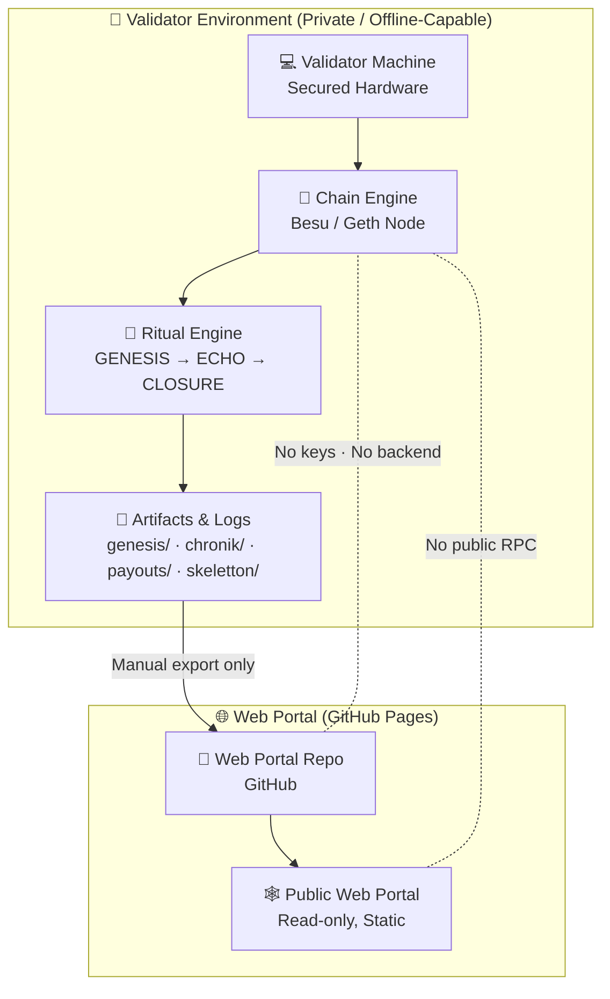

# 🧿 VALIDATOR-DIAGRAM.md — Chain2025 Validator Topology & Flow  
### CoreCraft Genesis • Validator‑Grade Topology

This document visualizes the **validator topology** and the **operational flow** between:

- Validator machine  
- Chain Engine  
- Ritual pipeline (Genesis → Echo → Closure)  
- Artifact export  
- Web Portal (read‑only)  

---

## 🧱 1. Validator Topology (ASCII Diagram)

```text
┌──────────────────────────────────────────────────────────────┐
│                    CHAIN2025 VALIDATOR TOPOLOGY              │
└──────────────────────────────────────────────────────────────┘

                 PRIVATE VALIDATOR ENVIRONMENT (OFFLINE‑CAPABLE)
                 ───────────────────────────────────────────────

┌───────────────────────┐
│  Validator Machine    │
│  (Secured Hardware)   │
└───────────────────────┘
            │
            ▼
┌───────────────────────┐
│   Chain Engine        │
│   (Besu / Geth Node)  │
└───────────────────────┘
            │
            ▼
┌───────────────────────┐
│   Ritual Engine       │
│  GENESIS → ECHO →     │
│          CLOSURE      │
└───────────────────────┘
            │
            ▼
┌───────────────────────┐
│  Artifacts & Logs     │
│  genesis/             │
│  chronik/             │
│  payouts/             │
│  skeletton/           │
└───────────────────────┘
            │
            │  (Manual export only)
            ▼
┌───────────────────────┐
│   Web Portal Repo     │
│   (GitHub Pages)      │
└───────────────────────┘
            │
            ▼
┌───────────────────────┐
│   Public Web Portal   │
│   (Read‑only, Static) │
└───────────────────────┘

        NO DIRECT RPC — NO LIVE CONNECTION — MANUAL ARTIFACT FLOW ONLY
```

---

## 🧬 2. Validator Flow (Mermaid Diagram)



---

## 🔗 3. Notes

- Validators operate **exclusively** in the **private environment**.  
- The **only bridge** between private and public is **manual artifact export**.  
- No RPC, no live sync, no backend logic in the Web Portal.  
- This diagram complements: `ARCHITECTURE.md`, `SECURITY.md`, `DEPLOYMENT.md`, `FLOW.md`, `VALIDATOR-OPERATIONS.md`.

---

## 📜 4. Git Usage

Add and commit:

```bash
git add VALIDATOR-DIAGRAM.md
git commit -m "Add validator topology & flow diagram"
git push
```
---